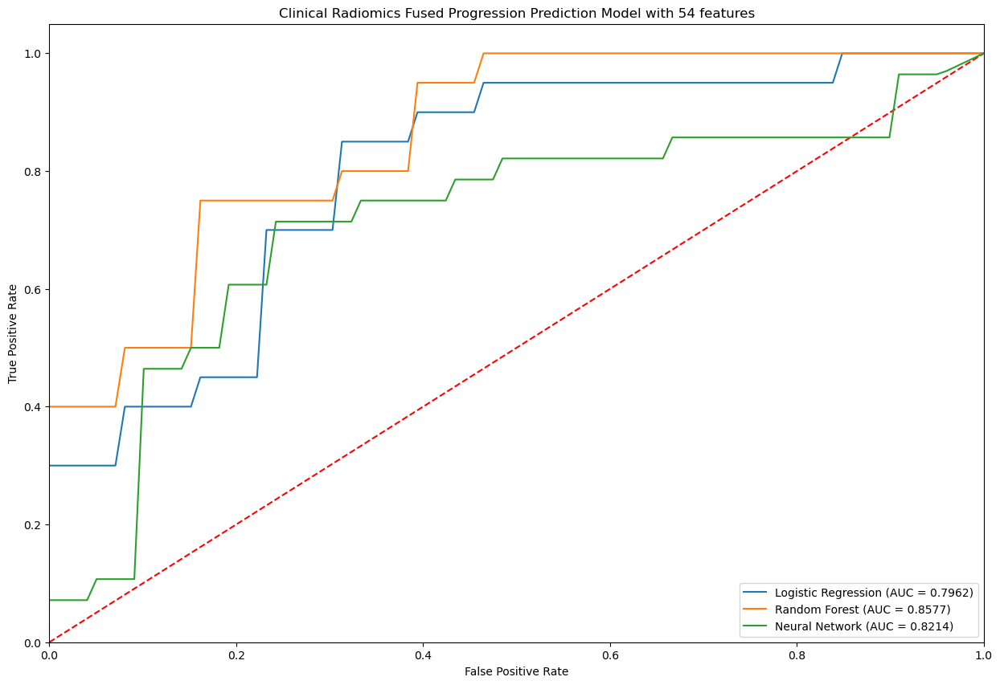

# Prostate Cancer Progress Prediction Model
## Introduction

The goal of this project was to make the best prediction model to accurately predict whether a patient would see progression in prostate cancer over 12 months. The data included lesion size and other informative features describing the lesion.

## Method
I tested 2 different datasets, one with the 8 most informative features and a dataset with all 54 features.

I cleaned the data by averaging missing values and removing unneeded columns (patient_id).

I normalized the data and fitted it to various models such as Random Forest, Logistic Regression, and Neural Networks. 

I then trained and tested the model over 1000 times to find the approximate performance of each model.

Then I analyzed the AUC ROC graph curve to understand the performance of each model more deeply.

## Results

I was able to achieve an average AUC score of 0.86 using random forest model for both models trained on dataset with 8 features and the dataset with 54 features. This was an improvement over the previous AUC score that another professor in the group achieved of 0.81. This means that I was able to predict prostate cancer progression over 12 months more accurately.

.png>)

Second project was also with my internship with University of Miami where I found the perlexity of gpt-2 on a corpus dataset (data on the internet) and found the 
distribution of the perlexity values.
Then I analyzed the graph and split the curve on the graph into low perplexity dataset, middle perlexity, and high perlexity. 
The goal of this project was to see if a model trained on low perplexity, medium, or high performed better or worse.
This would help create better machine learning models that are focused on a specific task such as in the medical field. 
Perplexity is the measure of quality of language models (basically how many tries it would take to correctly predict next word).

